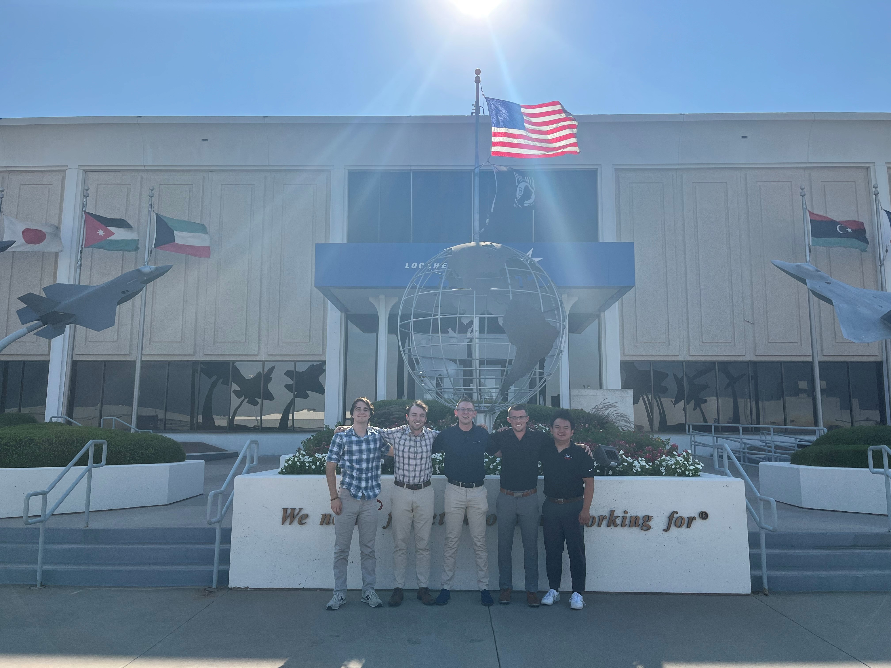
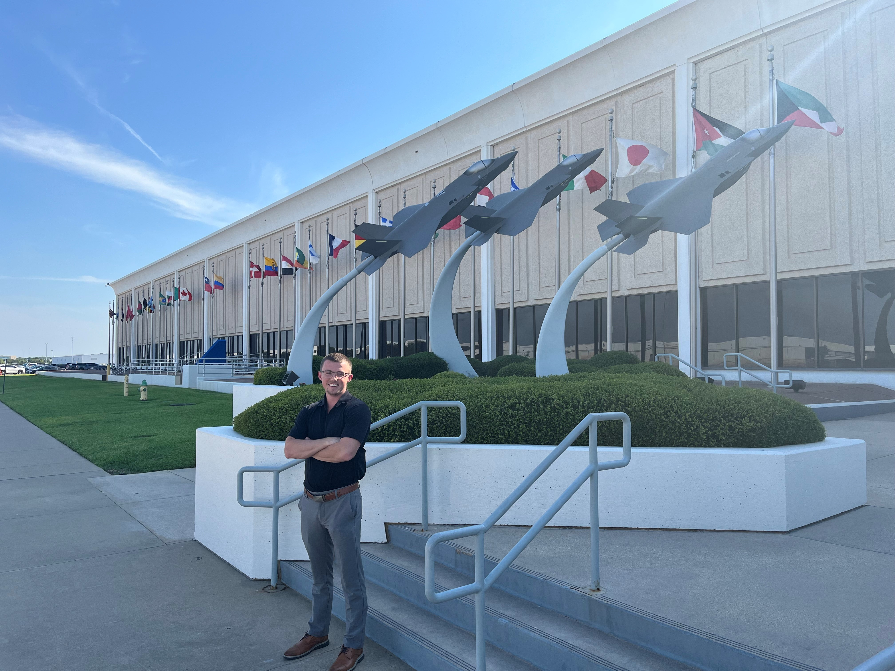

# Lockheed Martin Aeronautics
### **Sensor Fusion Software Engineering Intern**, *May 2023 - August 2023*

<body>
    <div class="cont">
        <div class="image-container">
            <div class="image-wrapper">
                  
            </div>
            <div class="image-wrapper">
                
            </div>
        </div>
  </div>
</body>

## About the Company

Lockheed Martin is a global aerospace and defense company. The support a wide range of advanced military aircraft and related technologies. Lockheed Martin Aeronautics is one of four major business segments of Lockheed Martin Corp that is best known for is creation and production of the F-35 Lightning II, F-22, and F-16 fighter jets.

## Role

As an intern I worked on the Sensor Fusion team for airframes. While working as an intern I was trained in the fundamental concepts of sensor fusion such as the Kalman Filter, Global Nearest Neighbor, and frames of reference. These algorithms are fundamental to data association and sensor tracking. 

Additionally I supported the team by developing an application to analyze a software libraries architecture based off of principles of [Clean Architecture](https://blog.cleancoder.com/uncle-bob/2012/08/13/the-clean-architecture.html) by Bob Martin. By creating this application, I developed a solid understanding of the principles behind good architecture design. These principles include circular dependencies, instability, abstractness, and encapsulation. 

While developing this tool I worked effectively in a team of six. We utilized the Agile development framework to complete tasks according to the product owners needs, planed sprints, demonstrated complete products, and evaluated teams effectiveness. 

## Skills Acquired/Utilized

#### Technical

```Sensor Fusion``` ```Data Association``` ```C#``` ```ASP.NET``` ```Winforms``` ```CMake``` ```Python``` ```Git``` ```Scaled Agile Development```


