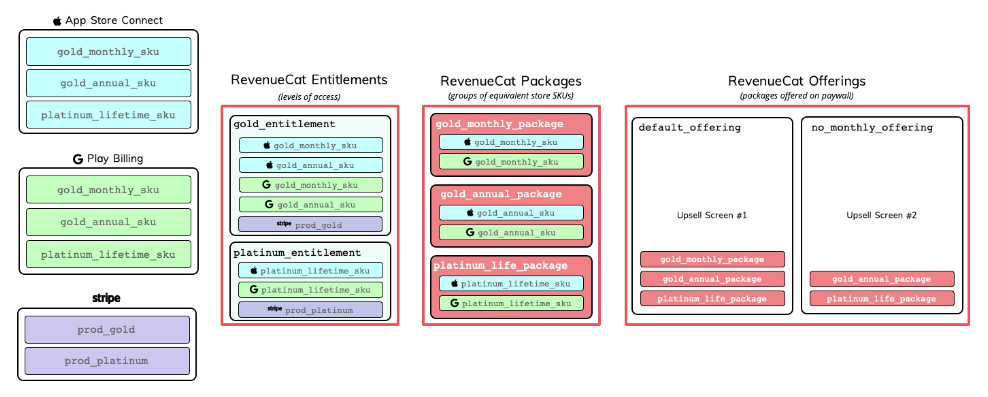

# Revenue Cat SetUp Documentation

* See [here](https://www.revenuecat.com/docs/entitlements) for more information

## Definitions

* Revenue Cat Product: Individual SKUs (Stock Keeping Unit) that users actually purchase. The stores (Apple, Google, Stripe, and Amazon) process these SKUs and charge the user.

    * Rapid Roster Product: Each individual app and their associated subscription purchase.

    * This is linked to Revenue Cat with a shared secret and Bundle ID

* Revenue Cat Entitlement: An entitlement represents a level of access, features, or content that a user is "entitled" to.

    * This is going to contain links to products. For example and app may have a "Gold" access but there are two different payment plans of monthly and yearly within App Store Connect, but they both unloack the same level of access. So both products are within the same entitlement.
    
    * Rapid Roster Entitlement: "Subscribed".

* Revenue Cat Package: a group of equivalent products across iOS, Android, and web.

* Offerings: The selection of products that are "offered" to a user on your paywall. They're an optional, but recommended feature of RevenueCat that can make it easier to change and experiment with your paywalls.

    * Each offering is going to contain one or more packages.

## Revenue Cat Example Illustration

    

