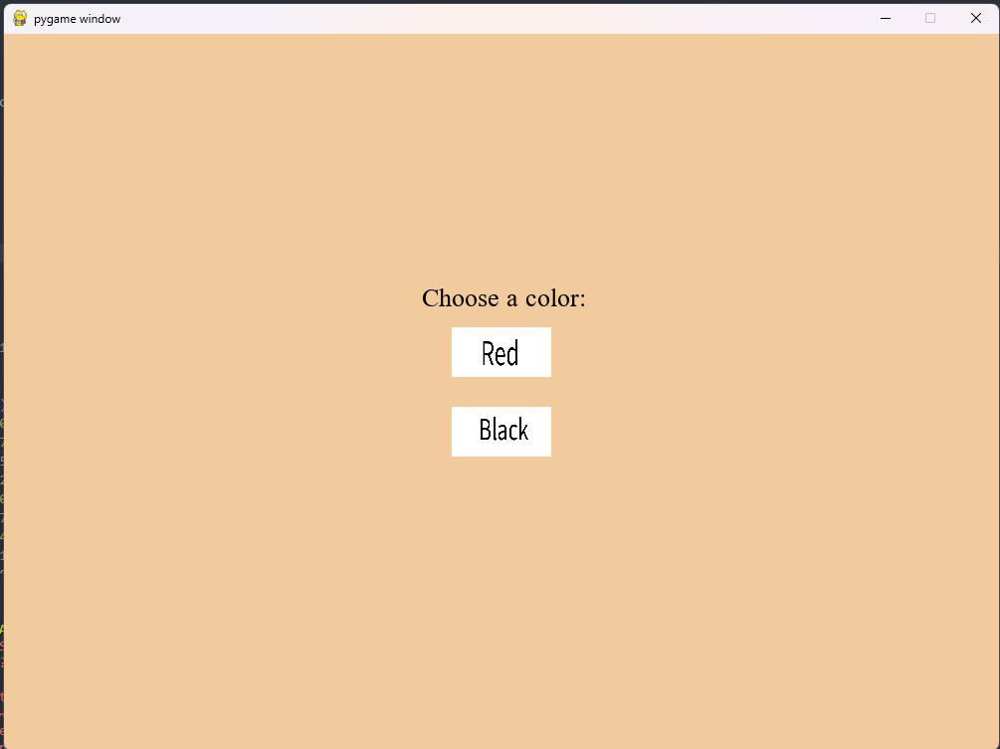

# Dumbo - A Xiangqi AI Player

* View code and other notes in our [repository](https://github.com/Peyton-Smith05/AI-project)

## Overview

In SUTD's Artificial Intelligence class we were assigned with the task of implementing an algorithm or concept we learned in class as a project. In a team of 4 we implemented the Mini-Max algorithm for the game Xiangqi. We chose to name our AI Dumbo because Xiangqi also means elephant chess. 

Xiangqi, also known as Chinese Chess, is a zero sum game that resembles that of Western Chess. Xiangqi is popular in China and other East Asian countries. The game is played on a board divided into ten horizontal lines and nine vertical lines, creating a total of 90 intersections. Each player has 16 pieces, with various abilities. These pieces include the General, Advisors, Elephants, Horses, Chariots, Cannons, and Soldiers. Each piece has its own movement abilities and strategic importance in the game. 

The game has a [Game Tree Complexity](https://en.wikipedia.org/wiki/Game_complexity) of ${10^{150}}$ meaning that there are more numbers of possible games to be played than chess. This illustrates the difficulty a computer may have searching through all the possible states efficiently.

|           | Game Tree Complexity  | State-Space Complexity |
| :---      |      :---:            |      :---:             |
| Chess     | ${10^{123}}$          | ${10^{44}}$            |
| Xiangqi   | ${10^{150}}$          | ${10^{40}}$            |

## Implementation

It was coded using python with the GUI done in pygame. 

### MiniMax Algorithm

The Minimax algorithm is a decision-making strategy commonly employed in two-play games with deterministic information. It determines the optimal move for a player by minimizing their maximum possible loss. At each level in the algorithm it evaluates the players position at each possibility based on a predetermined evaluation heuristic. For our project we used value of material, mobility of piece, and threats. 

Dumbo was able to achieve a search depth of 2 with just the basic implementation with it taking around 30 seconds per move. 

### Alpha-Beta Pruning

The next step was to implement optimizers in the search algorithm. Alpha-Beta pruning is a very common optimizer for this algorithm. It keeps track of the best move for itself and the worst move for its opponent. If it finds an better move for its opponent it knows it can already 'prune' that branch and not keep looking. At best case scenario it could prune thousands of options to look through. 

### Move Ordering

Move ordering helps Alpha-Beta pruning by putting the most likely to be best moves first so that the best case scenario of Alpha-Beta pruning occurs more often. 

With the implementation of these two optimizers Dumbo was able to achieve a search depth of 3 with it taking only about 5 seconds per move. 

## Results

We also created a playable GUI. The user selects what color they would like to play as and then the AI assumes the opposite color. Dumbo was able to beat myself and 1 other teammate who were novices to the game. Dumbo also won a few games against online intermediate bots. 

<body>

  

    

      <h2>Start Menu</h2>
        
    

    

      <h2>In Game</h2>
      
    

  

</body>
