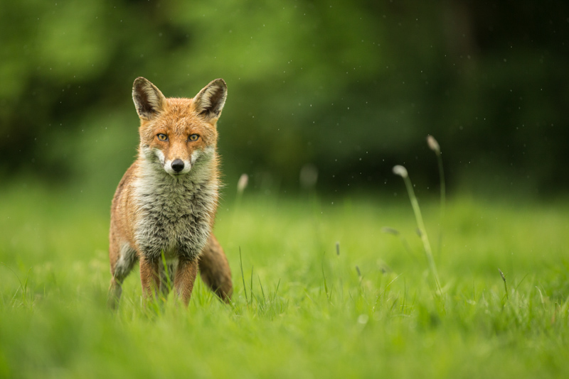
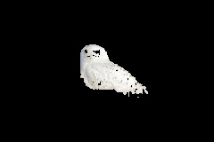

# Image Object Detection Using GMM and the *Expectation-Maximization Algorithm*

This project was done for a class assignment at SUTD for Machine Learning. io_data.py was provided for me as well as the image data in .jpg and .txt format. The rest of the code and implementation was written by me. Start by initializing the env by running ``python3 -m venv env`` then run ``source env/bin/activate`` then run ``pip install -r requirements.txt``. Then either run as a Jupyter Notebook with the env kernel or run ``python3 main.py``. The output will be the segmented images.

* **See code in [repository](https://github.com/Peyton-Smith05/Gaussian-Mixture-Model.git)**

## Implementation

My implementation used the given read_data() function to collect the LAB color values for ach pixel. It is then converted to a numpy array of ${n}$ by ${d}$ dimensions. ${n}$ being the number of pixels in the image and ${d}$ being 3 for each of the LAB values. I then initialized my weights, mean, and covariances with the kmeanInitialization() function. This function used the one iteration of k means to Cluster each of the points. From there the weights were initialized by $\frac{n_k}{n}$ for each value of ${k}$ where ${k}$ is 2 for the number of objects. In this case background and subject. The mean was initialized by taking the average of the individual ${L}$, ${A}$, and ${B}$ values for each cluster. The covariance is initialized the same way with the variance formula. 

Once the initialization step was done it went into a loop that checks for convergence. Then the *E-step* was next. In the *E-step* the responsibilities were calculated using the weights multiplied by the probability distribution function. This is done column by column where each column is an attribute ${k}$. Then I divided each row by the sum of the rows values to get a soft classification where the classified one will approach 1 and the unclassified one will approach 0.

Moving into the *M-step*, I then needed to update the respective means, covariances, weights and get the log likelihood to try and maximize that. This was done with the formulas in the slides and similar to the way they were initialized in the first place. Once the values were updated, I checked for convergence by comparing the old likelihood with the new one. Once the loop was complete, I had a function that got all of the labels and updated the image data with the according ***LAB*** values for the *write_data()* function. Those values were either their originals if it was the unmasked part or black if it was masked. In the main function, data was collected and stored in jpg format with the *read_data()* function.

Overall, this is a more probabilistic way to approach k-means. By using a probability distribution function and soft assignments it is less harsh than k means would be with its classifications functions. It allows for better generalization. Some updates and changes I had to make along the way was with the k-mean initialization. It was originally initialized with random centroids in the data. However, I made it so the algorithm would get stuck in a local minimum that wasn't a good classification. I decided to hard code initialization values that would lead to the right minimum and the results improved dramatically. The output images are shown in results. 

## Results

### Input

 <link rel="stylesheet" type="text/css" href="../../stylesheets/extra.css">

    <Text>Hello</Text>
    
    

### Output

## ***Update***

This algorithm reflects similar steps to the Kalman filter. There are some key differences however it uses Gaussian probability distributions to predict then update in a repetitive cycle. See my post about [Kalman Filters](../notes/kalman_filter_1d.ipynb) to learn more.