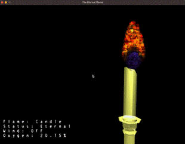
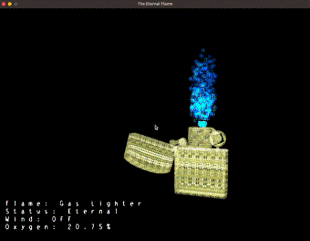

# Eternal Flame

Eternal Flame was a team project for my Computer Graphics class at SUTD. The goal of the project was to simulate particle motion, to model a flame, and render the particles with a build board implementation.

<!-- TODO : Format these two images -->

